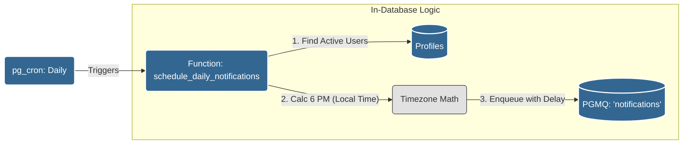
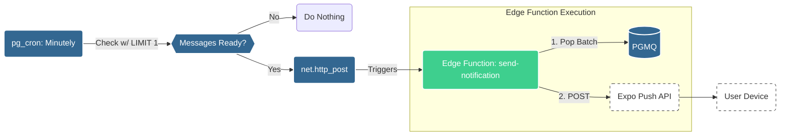

# Notification System Architecture

## Overview

The system operates in two distinct phases: **Scheduling** (Daily) and **Delivery** (Frequent). We utilize Supabase's internal database tools (`pg_cron`, `plpgsql`, `pgmq`) for the heavy lifting of logic and state, and use Edge Functions solely for the external HTTP requests to Expo.

---

## Phase 1: Scheduling (Daily)

Every day at **00:00 UTC**, the database wakes up to plan notifications for the next 24 hours.

**Key Process:**

1.  **Trigger**: `pg_cron` runs `schedule_daily_notifications()` via SQL.
2.  **Logic**: Iterates through active users.
3.  **Calculation**: `Target Time = User's Next 6 PM`.
4.  **Storage**: Inserts a job into `pgmq` with `delay = Target Time - Now`. The job sits invisibly in the queue.

---

## Phase 2: Delivery (Every Minute)

The system checks frequently for messages that have "woken up" (i.e., their delay period has passed).

**Key Process:**

1.  **Optimization**: `pg_cron` runs a lightweight `EXISTS` query first.
2.  **Trigger**: Only if messages are ready (`vt <= now()`), it calls the Edge Function.
3.  **Action**: The Edge Function pops a batch of messages and sends them to Expo.
